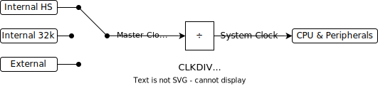
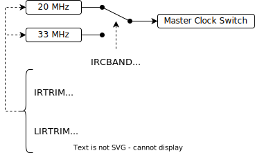

# Tuning the STC8G’s Internal RC Oscillators

## Introduction

The STC8G1K17A ([datasheet in Chinese](http://www.stcmicro.com/datasheet/STC8G-en.pdf)) is one of STC’s newer 8051-compatible MCUs with internal clock oscillators: a high-speed, “high-precision” oscillator and a low-speed, coarse 32 kHz one. Interestingly, the high-speed oscillator can be tuned by the user program, according to section 6.2 of the datasheet. This allows much finer control of the clock at run-time, unlike with STC’s previous chips where tuning can only be done by the ISP tool. The datasheet doesn’t provide any formula for calculating register values, though it does say loosely what each register does. This project investigates the relationship between the values of relevant registers and the resulting clock frequency, both for use in my own projects and potentially to help others develop their tools and projects.

## The STC8G’s Clock System

The clock is routed rather simply as follows (excluding clock output):

The internal high-speed oscillator is controlled by three registers:

`IRTRIM` is able to adjust the base frequency both upwards and downwards since both frequencies below 20 MHz and above 33 MHz are possible according to the datasheet. However it’s unclear what value of `IRTRIM` is the “origin”.

The datasheet states `IRTRIM` changes frequency linearly, so the 0.24% is probably relative to the base frequency and not the current frequency.

## The Plan

The plan is to write a program to switch through all combinations of `IRTRIM` and `LIRTRIM` for both the 20 MHz and 33 MHZ “bands”, and output a pulse lasting a fixed number of cycles so the frequency can be measured. In fact at each step it could output the `IRTRIM` and `LIRTRIM` values through the UART so the frequencies are conveniently labelled with the values.

~~*After trying for four days or so it seems my chip’s UART peripheral has gone bust for some reason as it doesn’t even work with official example code. As this chip has no debugging support, I probably won’t bother trying again…*~~ The SOP-8 parts in the STC8G family don’t have Timer 2. So that’s why. 🙄 Thanks to this post for pointing it out: http://www.51hei.com/bbs/dpj-201975-1.html.

